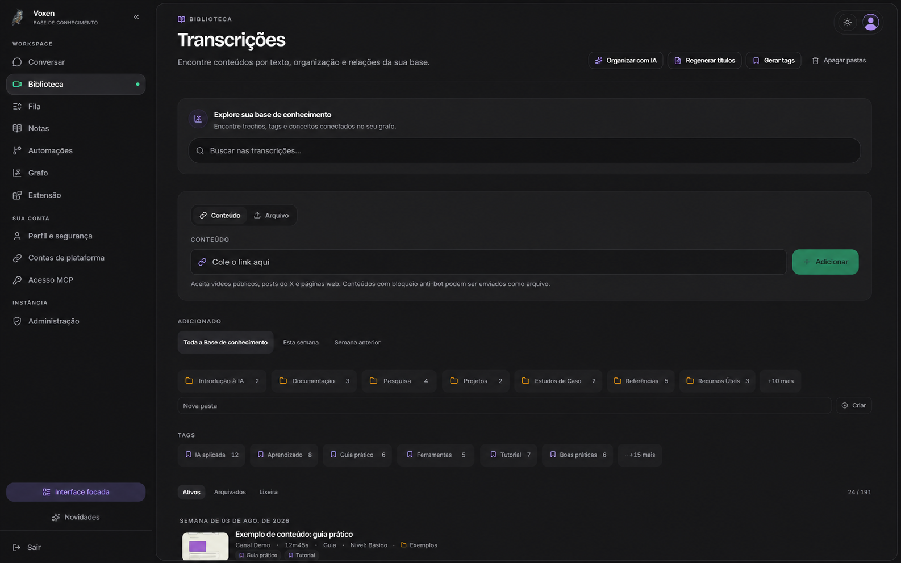
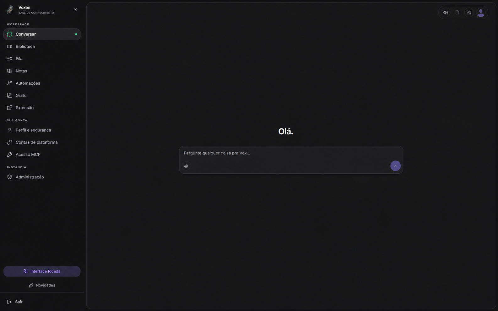

# Voxen

English | [Português (Brasil)](docs/README.md)

Voxen is a self-hosted **multimodal knowledge base** with transcription,
document and image analysis, agentic search, and a knowledge graph. External
agents can access the library through **MCP**. Retrieval is evidence-first and
does not require vector embeddings.

> [!IMPORTANT]
> **Project status: beta / active validation.** Voxen is already useful in the
> maintainer's personal workflow, but it is not yet considered fully stable.
> Bugs, rough edges, integration regressions, and breaking changes should be
> expected. Back up instance data and review the release notes before upgrading.





## What is already validated

The maintainer currently uses Voxen to collect and process supported YouTube
and TikTok links, selected public web pages, and especially posts from X. The
practical goal is already being met: useful material can live in one searchable
knowledge library instead of becoming a trail of links scattered across social
feeds, bookmarks, and personal notes.

This validation does not mean that every source or workflow is equally mature.
External platforms can change layouts, access policies, rate limits, and
anti-bot behavior without notice, so an integration that works today may need
maintenance after an upstream change.

Community experience is especially valuable during this phase. Share use cases,
deployment lessons, and product ideas in [GitHub Discussions](https://github.com/Yefclub/Voxen/discussions),
or use the [issue templates](https://github.com/Yefclub/Voxen/issues/new/choose)
for reproducible bugs and concrete improvement proposals. Never include tokens,
credentials, private content, or unredacted logs in a public report.

## What it does

1. Paste a URL or upload audio, video, image, or document files.
2. Voxen extracts the content, transcribes or chunks it when necessary, and
   sends only the required analysis to the configured models.
3. It stores structured Markdown with source metadata, timestamps, canonical
   links, and an AI-generated summary.
4. It organizes the library into folders and exposes it through chat, MCP, and
   the Brain knowledge graph.
5. Notes can preserve verified transcript passages by line and timestamp.
   Optional post-summary research stays in a separate cited review queue and
   enters retrieval only after explicit acceptance. Tool-free planning is
   isolated from bounded web-search turns so raw source text never accompanies
   a search tool.

## Stack

- **Web/API:** Bun, Hono, Vite, React, Tailwind CSS v4, and shadcn/ui
- **MCP:** user-scoped Streamable HTTP at `/mcp`; see the
  [client setup and compatibility guide](docs/en/MCP.md)
- **Worker:** Python asyncio, `yt-dlp`, and `ffmpeg`
- **Authentication:** Better Auth with email/password, optional OIDC SSO, and
  administrator approval
- **Database:** PostgreSQL 17, Prisma, and full-text search
- **Queue:** durable PostgreSQL jobs with leases and heartbeats; Redis is used
  for wakeups and realtime events
- **Storage:** shared local volume by default; optional MinIO/S3-compatible driver
- **Models:** OpenRouter, configured centrally by an administrator

## Local quick start

Requirements: Docker and Docker Compose v2.

```bash
git clone https://github.com/Yefclub/Voxen.git
cd Voxen
make dev
```

Open `http://localhost:3000`. The first account becomes the administrator and
enters onboarding. Add an OpenRouter key; Voxen validates it and applies the
canonical model configuration for the instance.

`make dev` creates or completes `.env` when necessary and starts PostgreSQL,
Redis, the web app, and the worker. Canonical Markdown and media use the shared
`storage_data` volume; MinIO is no longer required for a new single-host install.
Use `make dev-s3` with [`.env.s3.example`](.env.s3.example) only when you
deliberately want MinIO or another S3-compatible backend.

## Production deployment

Voxen is best suited to a home lab, where data stays under your control and a
residential IP is less likely to trigger media download restrictions. VPS,
Proxmox LXC, Docker Compose, nginx, and Easypanel deployments are also
supported. See the [deployment guide](docs/en/DEPLOY.md) for the complete
instructions.

For Easypanel, prefer the combined published image. One Voxen App already runs
the web/API, worker, and integrated chat runtime:

```text
ghcr.io/yefclub/voxen:latest
```

Repository/Dockerfile source mode makes environment values available during
the build and can expose secrets through build arguments or logs. Prefer image
deployment so application secrets are supplied only at runtime. Provision
PostgreSQL and Redis, and mount a persistent volume at `/data/storage` in the
Voxen App. MinIO/S3 is an optional advanced topology for external or multi-host
storage; the residential proxy agent is optional and only needed when a VPS
must extract media through a home-network IP.

A minimal Docker Compose deployment starts with:

```bash
git clone https://github.com/Yefclub/Voxen.git ~/voxen
cd ~/voxen
cp .env.example .env
# Edit secrets and APP_BASE_URL before continuing.
mv docker-compose.override.yml docker-compose.override.dev.yml
docker compose up -d --build
```

Migrations are applied automatically by the web container through
`prisma migrate deploy`.

## Operations

Safe update commands preserve the PostgreSQL, Redis, and selected storage volumes:

```bash
make update
make build
make restart
make backup
```

Do not run `make clean` in production: that target removes all volumes after an
interactive confirmation.

Voxen intentionally does not require SMTP for password recovery. An instance
owner can reset a password from the server and revoke existing sessions:

```bash
make reset-password EMAIL=user@example.com PASSWORD='a-new-strong-password'
```

## Documentation

The [documentation index](docs/README.md) links the English and Portuguese
documentation tracks.

| Document                                          | Topic                                                  |
| ------------------------------------------------- | ------------------------------------------------------ |
| [Development](docs/en/DEVELOPMENT.md)             | Local environment, tests, SDD/TDD, and workflow        |
| [Deployment](docs/en/DEPLOY.md)                   | Home lab, VPS, Proxmox, nginx, Compose, and Easypanel  |
| [Architecture](docs/en/ARCHITECTURE.md)           | Components, flows, and architectural decisions         |
| [Stack](docs/en/STACK.md)                         | Runtime and dependency choices                         |
| [Decisions](docs/en/DECISIONS.md)                 | Architecture Decision Records                          |
| [Security](docs/en/SECURITY.md)                   | Threat model and technical controls                    |
| [MCP clients](docs/en/MCP.md)                     | Client setup, compatibility, security, troubleshooting |
| [Mem0 shadow evaluation](docs/en/MEM0-SHADOW.md)  | Optional conversational-memory experiment and decision |
| [Transcript format](docs/en/TRANSCRIPT-FORMAT.md) | Canonical Markdown schema                              |
| [Contributing](CONTRIBUTING.md)                   | Contribution requirements                              |
| [Security policy](SECURITY.md)                    | Private vulnerability reporting                        |
| [Support](SUPPORT.md)                             | Where to ask for help                                  |
| [Changelog](CHANGELOG.md)                         | Release and development history                        |

## Branch and release workflow

`main` is the stable default branch and `dev` is the protected integration
branch. Feature and maintenance pull requests target `dev`. Stable releases are
prepared from `dev`, reviewed through a pull request to `main`, and published as
SemVer tags.

## License

MIT — see [LICENSE](LICENSE).
